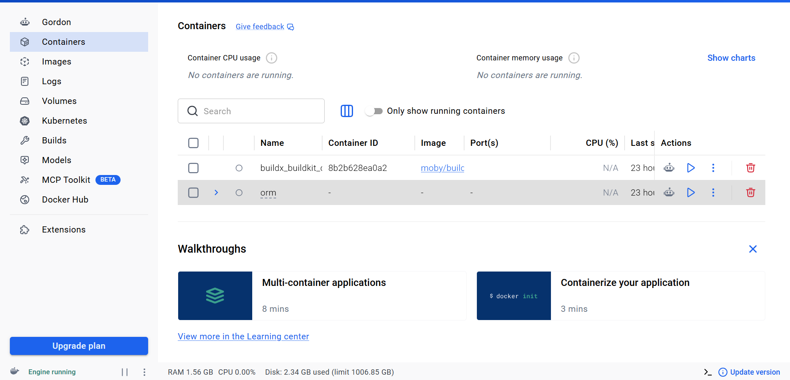
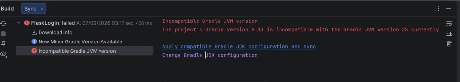
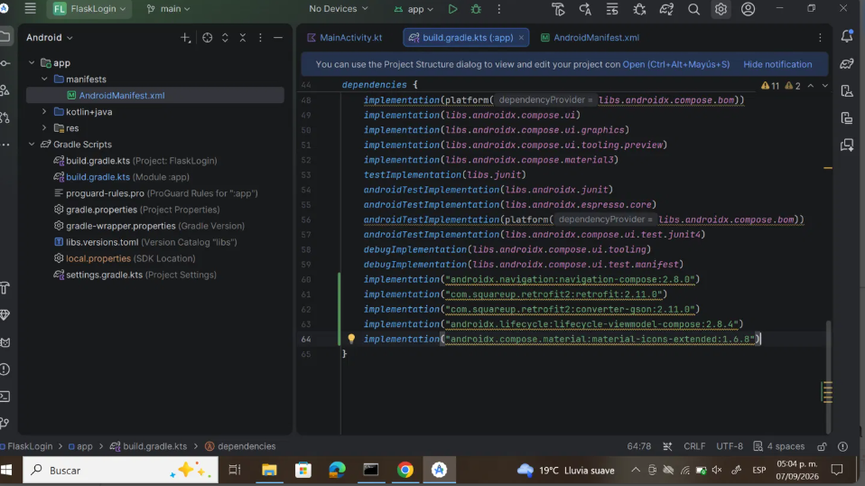
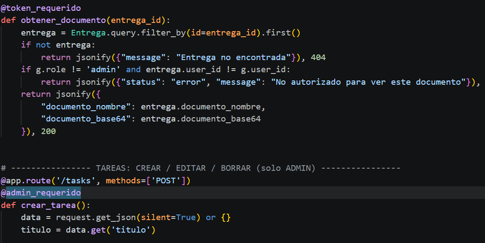
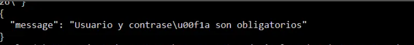
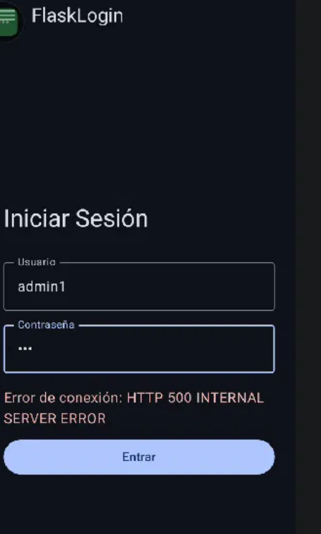

# Práctica 2.- "Aplicación móvil básica"

## Portada
* **Nombre:** Téllez Girón Castro Ángel Ricardo
* **Boleta:** 2024630154
* **Grupo:** 7CV4
* **Asignatura:** Desarrollo de aplicaciones móviles nativas
* **Profesor:** Hurtado Avilés Gabriel 
* **Fecha de entrega:** 18/09/2026

---

## Objetivo 

Desarrollar una aplicación móvil nativa en Android (Kotlin + Jetpack Compose) conectada a un servicio
REST propio (Flask + SQLite, dockerizado), que implemente un sistema de autenticación seguro con
contraseñas hasheadas y sesiones basadas en JSON Web Tokens (JWT), diferenciando dos roles de usuario
(administrador y normal) con permisos distintos sobre un recurso CRUD de tipo "tareas escolares": el
administrador puede crear, editar, eliminar y calificar tareas; el usuario normal puede consultarlas,
adjuntar un documento como evidencia y entregarlas. El proyecto busca demostrar el manejo de
comunicación cliente-servidor mediante Retrofit, el ciclo de vida de la app con ViewModel y estados de
UI (carga/error/éxito/sesión), y el despliegue reproducible del backend con Docker Compose.

---

##Intrducción 

Para esta práctica se usó como punto de partida el repositorio brindado por el profesor, con el fin de
entender la estructura base de un backend Flask con ORM y de una app Android en Jetpack Compose ya
conectados entre sí. El repositorio inicial se encuentra en:
https://github.com/gabrielhuav/Flask-Compose-Login-API 

A partir de esa base se amplió considerablemente tanto el backend como el frontend para cumplir con
los requisitos de la práctica: autenticación con JWT, roles de usuario, un recurso CRUD completo, un
flujo de entrega/calificación de tareas con documentos adjuntos, y manejo visible de los distintos
estados de la interfaz. Todos los archivos y cambios se documentan a continuación; no soy autor de
todo lo que se encuentra en el repositorio original y se usó como base tal como lo permite el profesor.

---

## Desarrrollo 

### 1. Archivos que se modificaron 

* **`Docker-Flask/ORM/app.py`** (backend): reescrito para incluir:
  - Modelo `User` con columna `role` (`admin` / `normal`).
  - Modelo `Task` (tarea/asignación creada por el admin).
  - Modelo `Entrega` (relación N a N entre `Task` y `User`, una entrega por alumno por tarea).
  - Autenticación con `Flask-Bcrypt` (hash con sal) y sesiones mediante JWT firmado (`PyJWT`), con
    expiración configurable.
  - Endpoint `/register` que acepta una llave opcional `admin_key` para crear cuentas administradoras.
  - Endpoints CRUD completos sobre `/tasks` (protegidos solo para admin) y endpoints de entrega
    (`/tasks/<id>/entregar`), consulta de entregas (`/tasks/<id>/entregas`), documento
    (`/entregas/<id>/documento`) y calificación (`/entregas/<id>/calificar`).
  - Manejo de códigos de estado HTTP 200, 201, 400, 401, 403 y 404 según el caso.
* **`Docker-Flask/ORM/requirements.txt`**: se agregó `PyJWT` para la generación y verificación de
  tokens.
* **`Docker-Flask/ORM/docker-compose.yml`**: se agregaron las variables de entorno `SECRET_KEY`,
  `JWT_EXP_MINUTES` y `ADMIN_CREATION_KEY` necesarias para la firma de tokens y la creación controlada
  de administradores (ver sección de *Decisiones técnicas*).
* **`Android/FlaskLogin/app/src/main/java/ovh/gabrielhuav/flasklogin/MainActivity.kt`**: se eliminó el
  contenido de plantilla generado por Android Studio y se construyó desde cero:
  - Pantallas `LoginScreen`, `RegisterScreen`, `TareaNormalListScreen` (vista de usuario normal),
    `CrudListScreen` y `EntregasScreen` (vista de administrador), todas en Jetpack Compose / Material 3.
  - `ViewModel`s (`LoginViewModel`, `RegisterViewModel`, `CrudViewModel`, `TareaNormalViewModel`) con
    manejo explícito de estados `Idle / Loading / Success / Error`.
  - `SessionManager` como objeto en memoria que guarda el token JWT, el nombre de usuario y el rol
    activo, usado para condicionar la navegación y habilitar/deshabilitar el acceso al panel de
    Operaciones CRUD.
  - Un menú de navegación lateral (`ModalNavigationDrawer`) con las opciones Inicio de Sesión, Registro
    de Usuario y Operaciones CRUD (esta última visible pero deshabilitada si el usuario no es admin).
  - Botón de cerrar sesión en la barra superior.
  - Selector de archivos (`ActivityResultContracts.GetContent`) y codificación a Base64 para adjuntar
    documentos desde la app; y un `FileProvider` + `Intent.ACTION_VIEW` para que el administrador pueda
    abrir el documento recibido (PDF, Word, Excel, imagen, etc.) con cualquier app instalada en el
    dispositivo.
  - Integración con Retrofit + Gson para el consumo de la API, incluyendo el envío del header
    `Authorization: Bearer <token>` en cada endpoint protegido.
* **`Android/FlaskLogin/app/build.gradle.kts`**: se agregaron las dependencias
  `androidx.navigation:navigation-compose`, `com.squareup.retrofit2:retrofit`,
  `com.squareup.retrofit2:converter-gson`, `androidx.lifecycle:lifecycle-viewmodel-compose` y
  `androidx.compose.material:material-icons-extended`.
* **`Android/FlaskLogin/app/src/main/AndroidManifest.xml`**: se agregaron los permisos
  `INTERNET`, `READ_MEDIA_IMAGES` y `READ_EXTERNAL_STORAGE` (este último limitado a `maxSdkVersion=32`),
  el atributo `android:usesCleartextTraffic="true"` (necesario para consumir la API por HTTP sin TLS
  durante el desarrollo local), y un `<provider>` de tipo `FileProvider` para poder compartir
  documentos temporales con otras aplicaciones.
* **`Android/FlaskLogin/app/src/main/res/xml/file_paths.xml`** (nuevo): configuración de rutas
  requerida por el `FileProvider`.

Se usó Jetpack Compose de forma declarativa para reaccionar a los cambios de estado (sesión iniciada,
rol del usuario, carga/error de red) sin manipular vistas manualmente. Retrofit junto con las
corrutinas de Kotlin garantiza una comunicación de red asíncrona sin bloquear el hilo principal de la
interfaz. Del lado del backend se mantuvo Flask por ser el framework ya usado en el repositorio base,
extendido con `Flask-Bcrypt` para el hasheo de contraseñas y `PyJWT` para la implementación de sesiones
seguras sin necesidad de mantener estado de sesión en el servidor (autenticación *stateless*).

### 2. Preparación del entorno

El primer paso fue clonar el repositorio base y explorar su estructura, separada en dos carpetas
principales: `Docker-Flask/ORM` (backend) y `Android/FlaskLogin` (app). Antes de escribir cualquier
línea de código propia, se verificó que el entorno base funcionara:

* Se instaló y abrió **Docker Desktop**, requisito indispensable para levantar el backend sin instalar
  Python de forma local.
* Se abrió el proyecto Android en **Android Studio**, confirmando el paquete real (`ovh.gabrielhuav.flasklogin`)
  y el tema (`FlaskLoginTheme`) generados por la plantilla.

Imagen de Docker Desktop abierto y corriendo: <br>
<br>

Durante esta etapa se presentó un primer obstáculo: al sincronizar Gradle por primera vez, Android
Studio reportó el error **"Incompatible Gradle JVM version"**, ya que el JDK 25 instalado en el sistema
no era compatible con la versión de Gradle (8.13) que trae el proyecto. Se resolvió cambiando el JDK
usado por Gradle a una versión compatible (JetBrains Runtime 17) desde
`File > Project Structure > SDK Location`.

Imagen del error de incompatibilidad de JDK en el panel Build: <br>
<br>

Imagen de la sincronización de Gradle exitosa tras el cambio de JDK: <br>
<br>

### 3. Backend: dockerización, hasheo de contraseñas y sesiones con JWT

Se partió del `app.py` original, que solo exponía `/`, `/register` y `/login` sin manejo de sesiones
persistentes. Se amplió en las siguientes etapas:

* **Hasheo de contraseñas:** se mantuvo `Flask-Bcrypt`, ya incluido en el repositorio base, verificando
  que ninguna contraseña se almacenara en texto plano en `site.db`.
* **Sesiones con JWT:** se agregó la librería `PyJWT` (fue necesario añadirla manualmente a
  `requirements.txt`, ya que no venía en el ejemplo original) para generar un token firmado en cada
  login, con expiración configurable mediante la variable de entorno `JWT_EXP_MINUTES`. Se implementó
  un decorador `token_requerido` que valida el token en cada endpoint protegido y responde `401` si es
  inválido, expiró o no fue enviado.
* **Roles de usuario:** se agregó una columna `role` al modelo `User` (`admin` o `normal`). El registro
  acepta un campo opcional `admin_key`; solo si coincide con la variable de entorno
  `ADMIN_CREATION_KEY` la cuenta se crea como administradora. Se agregó un segundo decorador,
  `admin_requerido`, que además de validar el token exige que el rol sea `admin`, respondiendo `403`
  en caso contrario.

Imagen del `app.py` con los decoradores `token_requerido` y `admin_requerido`: <br>
<br>

Las pruebas de estos endpoints se hicieron con `Invoke-RestMethod` de PowerShell en lugar de `curl.exe`,
ya que este último no interpreta las comillas simples como delimitador en Windows, lo cual generaba
JSON inválido y respuestas de error como `"Usuario y contraseña son obligatorios"` incluso enviando los
datos correctos.

Imagen de la creación del primer usuario administrador vía `Invoke-RestMethod`: <br>
<br>

Un problema recurrente durante esta etapa fue el error **HTTP 500 Internal Server Error** al modificar
el modelo `User` o `Task` (por ejemplo, al agregar la columna `role`). La causa fue que el archivo
`instance/site.db` ya existía con el esquema de tabla anterior, y `db.create_all()` no actualiza tablas
existentes. La solución aplicada cada vez que se modificó un modelo fue borrar `instance/site.db` y
reconstruir el contenedor con `docker compose up --build`.

Imagen del error 500 al iniciar sesión tras modificar el modelo de datos: <br>
<br>

### 4. Frontend: navegación, estados de UI y roles

Sobre el proyecto Android base (una única pantalla de plantilla con "Hello Android"), se construyó
desde cero, todo dentro de `MainActivity.kt`:

* Un `SessionManager` en memoria que guarda el token JWT, el nombre de usuario y el rol activo tras el
  login.
* Pantallas `LoginScreen` y `RegisterScreen` con manejo explícito de los tres estados de interfaz
  pedidos en la práctica: **carga** (`CircularProgressIndicator`), **error** (mensaje en rojo) y
  **sesión iniciada** (redirección automática según el rol).
* Un menú de navegación lateral (`ModalNavigationDrawer`) con las opciones de Inicio de Sesión,
  Registro de Usuario y Operaciones CRUD, esta última visualmente atenuada (`Modifier.alpha`) y
  deshabilitada si el usuario activo no es administrador.
* Un botón de **cerrar sesión** en la barra superior (`TopAppBar`), visible solo si hay sesión activa,
  que limpia el `SessionManager` y regresa a la pantalla de Login.

Durante esta etapa se detectó que, al iniciar sesión, la app navegaba siempre al panel de administrador
sin distinguir el rol del usuario. Se corrigió condicionando la navegación tras el login
(`if (SessionManager.isAdmin) Screen.Crud.route else Screen.Home.route`) y agregando una ruta y
pantalla separadas (`TareaNormalListScreen`) para el flujo del usuario normal.

### 5. Configuración de red y solución de problemas de conectividad

Esta fue la etapa con más iteraciones del proyecto, ya que la dirección correcta para `BASE_URL`
depende completamente de dónde se ejecute la app (ver la sección *Configuración de la URL base* más
abajo para el detalle completo de cada método). En resumen, se probaron y descartaron o adoptaron:

### Configuración de la URL base

* **`10.0.2.2` (emulador):** funciona siempre, pero requiere usar el emulador de Android Studio en vez
  de un dispositivo físico.
* **IP local de la PC (celular físico en la misma red Wi-Fi):** funcionó correctamente en la red
  doméstica, pero **falló por completo en la red institucional del IPN**, mostrando
  `ERR_ADDRESS_UNREACHABLE` en el navegador del celular incluso con la regla de Firewall de Windows
  correctamente configurada para el puerto 5000 — un síntoma típico de aislamiento entre dispositivos
  ("AP/Client isolation") en redes de campus.

* **Hotspot del propio celular:** como alternativa dentro de la misma red Wi-Fi, se probó conectar la
  PC al hotspot personal del celular, lo cual sí permitió la comunicación, aunque generó un efecto
  secundario: Docker Desktop no pudo resolver el DNS de `registry-1.docker.io` tras el cambio de red,
  por lo que fue necesario reiniciar Docker Desktop para que detectara la nueva conexión.>

* **`adb reverse` por USB (método final adoptado para pruebas en celular físico):** permite mantener
  `localhost:5000` como `BASE_URL` sin depender de ninguna red Wi-Fi, ya que el túnel viaja por el
  cable USB. Este fue el método más confiable frente al aislamiento de la red institucional.

### 6. CRUD de tareas (administrador)

Se implementó el recurso elegido, **Tarea**, con las cuatro operaciones CRUD completas, protegidas
todas para que solo un usuario con rol `admin` pueda ejecutarlas (`POST`, `PUT`, `DELETE` sobre
`/tasks`, y `GET` accesible a cualquier usuario autenticado). En Kotlin, se construyó `CrudListScreen`
con una `LazyColumn` de tarjetas, cada una con íconos de editar (lápiz) y eliminar (bote de basura), y
un botón `+` para crear una tarea nueva mediante un formulario emergente (`TareaFormDialog`).

### 7. Sistema de entregas y calificación (usuario normal ↔ administrador)

Se extendió el recurso CRUD para simular un flujo de tareas escolares: el administrador crea la tarea,
un usuario normal la entrega adjuntando un documento, y el administrador la califica.

La primera versión de este sistema guardaba el estado de entrega (`entregada`, `documento_nombre`,
`calificacion`) directamente como columnas del modelo `Task`. Esto causó un error funcional detectado
durante las pruebas: **al entregar un usuario, la tarea quedaba marcada como entregada para todos los
usuarios**, impidiendo que un segundo alumno pudiera entregar la misma tarea. Se corrigió creando una
tabla independiente, **`Entrega`**, relacionada por `task_id` y `user_id`, de modo que cada alumno
tiene su propio registro de entrega por cada tarea.

Del lado de Android, se agregó a `TareaNormalListScreen` un selector de archivos
(`ActivityResultContracts.GetContent`), que codifica el archivo elegido a Base64 y lo envía al endpoint
`/tasks/<id>/entregar`. Del lado del administrador, se agregó `EntregasScreen`, accesible desde un
botón "Ver entregas" en cada tarea, que lista una tarjeta por cada alumno que entregó, con botones para
ver el documento y calificar.

### 8. Visualización de documentos entregados

Para que el administrador pudiera revisar el documento entregado (imágenes, PDF, Word, Excel, etc.), se
evaluaron tres alternativas: un visor de PDF nativo (limitado solo a ese formato), guardar el archivo en
Descargas, o delegar la apertura a otra aplicación instalada en el celular. Se optó por esta última,
por ser la única que cubre **todos** los formatos sin depender de librerías de terceros, dado que
Android no cuenta con un renderizador nativo para documentos de Office.

Se implementó un `FileProvider` (configurado en `AndroidManifest.xml` y en
`res/xml/file_paths.xml`), que permite guardar temporalmente el archivo recibido en Base64 dentro del
caché de la app y compartirlo de forma segura con otras apps mediante un `Intent.ACTION_VIEW`, abriendo
el selector "Abrir con..." del sistema.

---

## Criterio de evaluación

Esta práctica se evaluará clonando el repositorio en un equipo limpio y siguiendo este README al pie
de la letra, en el orden en que está documentado. Si el entorno no levanta siguiendo exactamente los
pasos aquí descritos, la práctica se considerará no funcional. Por esta razón, antes de la entrega se
verificó el proyecto completo desde cero, confirmando lo siguiente:

### Sobre la URL base (`BASE_URL`)

* Si se evalúa con el **emulador de Android Studio**, `BASE_URL` debe estar en
  `http://10.0.2.2:5000` — funciona siempre, sin pasos adicionales.
* Si se evalúa con un **celular físico**, `BASE_URL` debe estar en `http://localhost:5000`, **y el
  celular debe permanecer conectado por cable USB a la computadora durante toda la prueba**, ya que
  este valor solo funciona mientras el túnel de depuración esté activo. Antes de abrir la app, es
  obligatorio ejecutar en una terminal (con el celular conectado y la depuración USB autorizada):
```powershell
  adb reverse tcp:5000 tcp:5000
```
  Si no se ejecuta este comando, o si se desconecta el cable en cualquier momento, la app mostrará
  `Failed to connect to localhost/127.0.0.1:5000` y no podrá comunicarse con el backend. Si el comando
  `adb` no es reconocido por la terminal, debe ejecutarse con la ruta completa, por ejemplo:
```powershell
  & "C:\Users\<usuario>\AppData\Local\Android\Sdk\platform-tools\adb.exe" reverse tcp:5000 tcp:5000
```
* **No se debe usar la IP local de la PC (`192.168.x.x`)** salvo que se confirme previamente que la red
  Wi-Fi utilizada no tiene aislamiento entre dispositivos, ya que este método falló en redes
  institucionales durante el desarrollo (ver sección *Configuración de la URL base*).

### Sobre el usuario administrador

El registro desde la app **siempre crea usuarios con rol `normal`**. Para evaluar el panel de
Operaciones CRUD (exclusivo de administradores), es obligatorio crear un usuario admin manualmente
antes de abrir la app, ejecutando en una terminal (con el backend ya corriendo):

```powershell
Invoke-RestMethod -Uri "http://localhost:5000/register" -Method POST -ContentType "application/json" `
  -Body (@{username="admin1"; password="1234"; admin_key="miClaveAdminSecreta2026"} | ConvertTo-Json)
```

Esto crea el usuario **`admin1`** con contraseña **`1234`**, con el que se debe iniciar sesión desde la
app para acceder al panel de administrador. El valor `admin_key` (`miClaveAdminSecreta2026`) debe
coincidir exactamente con la variable `ADMIN_CREATION_KEY` definida en `docker-compose.yml`; si no
coincide, el usuario se crea como `normal` en lugar de `admin`, y no se podrá evaluar el CRUD.

### Checklist final antes de la entrega

* [ ] El backend levanta correctamente con `docker compose up --build` sin pasos adicionales no
  documentados.
* [ ] Se creó el usuario `admin1` / `1234` con el comando de arriba, y su login lleva al panel
  "Tareas (Admin)".
* [ ] El valor de `BASE_URL` en `MainActivity.kt` corresponde al método de conexión que se usará
  durante la evaluación (emulador o `adb reverse` con USB conectado).
* [ ] Si se usa `adb reverse`, el comando se ejecutó **antes** de abrir la app y el cable permanece
  conectado.
* [ ] La app compila e instala sin errores tras un `Sync Project with Gradle Files` limpio.

---
## Conclusión
En esta práctica se logró desarrollar y ampliar una aplicación móvil nativa utilizando Kotlin y Jetpack Compose, conectada a un backend desarrollado con Flask, SQLite y Docker. Se implementaron funciones importantes como el inicio de sesión con JWT, manejo de roles, operaciones CRUD para tareas, entrega de documentos y calificación. Además, se trabajó con Retrofit, ViewModel y estados de la interfaz, fortaleciendo la comunicación entre la aplicación y el servidor.

Durante el desarrollo también se resolvieron diferentes problemas relacionados con la compatibilidad de Gradle, la base de datos y la conexión entre el celular y el backend. Esto permitió comprender mejor la importancia de configurar correctamente el entorno y realizar pruebas de cada funcionalidad. En general, la práctica permitió integrar varios conceptos de desarrollo móvil y comunicación cliente-servidor en un proyecto funcional. 